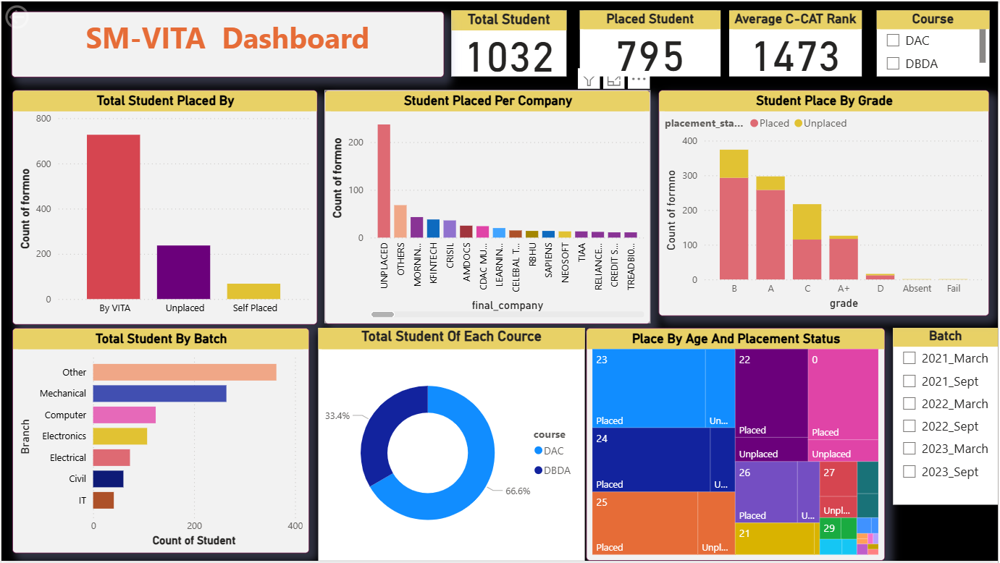

# 📊 SM-VITA Student Placement Dashboard

## 📌 Project Overview
The **SM-VITA Dashboard** is an interactive **Power BI project** designed to analyze and visualize **student placement statistics**.  
It provides insights into **placement trends, company-wise recruitment, student performance by grade, branch distribution, and course comparison**.  

This dashboard helps academic institutions, training centers, and students track placement progress and make data-driven decisions.

---

## 🚀 Features
- 📌 **Total Student & Placement Summary**  
  - Displays total students, placed students, and average C-CAT rank.
  
- 📊 **Placement Analysis**
  - Placement distribution by **VITA, self-placement, or unplaced**.
  - Company-wise placement statistics.
  - Placement status based on grades (A, B, C, etc.).

- 🎓 **Student Insights**
  - Distribution of students by **branch**.
  - Course-wise breakdown (**DAC vs DBDA**).
  - Placement trends by **age and batch**.

- 📅 **Batch-Wise Comparison**
  - Filter by batch (March/Sept 2021–2023) for detailed analysis.

---

## 📂 Dashboard Components
1. **Total Student Placed By** – Bar chart (By VITA, Unplaced, Self Placed)  
2. **Student Placed Per Company** – Company-wise placement analysis  
3. **Student Place By Grade** – Placement vs Grade distribution  
4. **Total Student By Batch** – Branch-wise student count  
5. **Total Student Of Each Course** – Pie chart of DAC vs DBDA  
6. **Place By Age And Placement Status** – Treemap visualization  
7. **Batch Filter** – Filter panel for batch-wise analysis  

---

## 🛠️ Tools & Technologies
- **Power BI** – Data visualization & dashboard design  
- **Excel/CSV** – Data source for student placement records  
- **DAX / Power Query** – Data transformation and calculated measures  

---

## 📸 Dashboard Preview
  

---

## 📊 Insights from Dashboard
- Majority of placements are facilitated **by VITA**.  
- **DAC students** represent ~67% of the dataset compared to DBDA.  
- Most students belong to **Mechanical & Other branches**.  
- Highest placements happen for students with **B and A grades**.  

---

## 📥 How to Use
1. Clone the repository:  
   ```bash
   git clone https://github.com/your-username/sm-vita-dashboard.git
